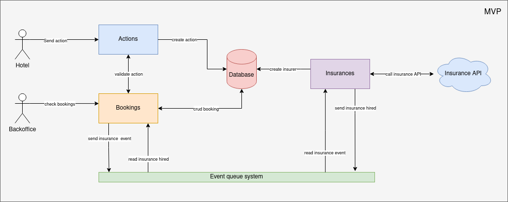
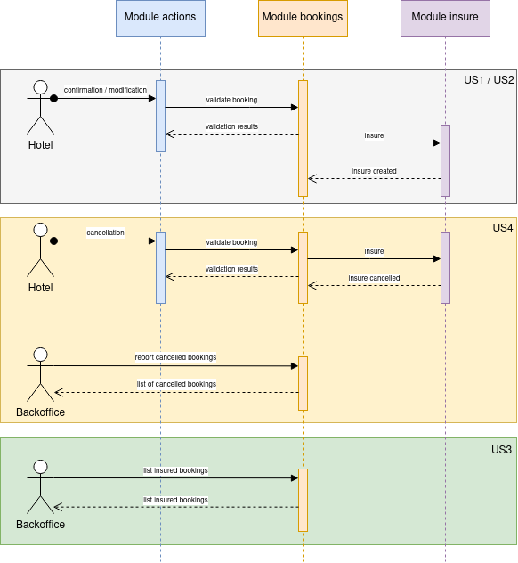
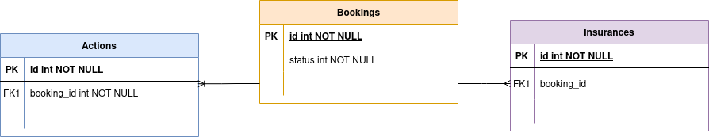
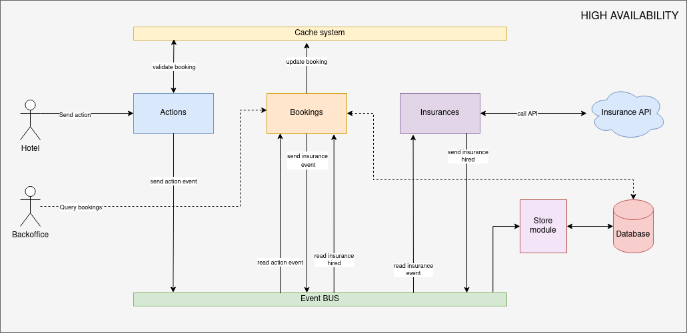

# Bookings test case

This project is a test case to insure hotel bookings.

We will follow a hexagonal architecture in order to be able in the future to grow up the project according to the
necessities.

The first approach will be an MVP where we will keep the things simple as possible. For example, we don't know yet how 
to call the insurance API, so it makes sense in order to don't wait for that information that we implement all the other
features.

To be able to start and finish without knowing the insurance API, we will use events to launch the insurer feature. By 
doing that it allows us to implement the rest of features for the MVP and also to grow up in the future by increasing 
the events which we will use.

We will divide the future stages of this application in two: MVP, High availability. In this project we will only
implement the MVP part, but we also define how will be the High availability architecture.

## MVP
Here we get a diagram that will explain the architecture that we will follow.

As you can see in the diagrams we will separate the applications into three different parts that in the future could
evolve to a different applications or microservices. The modules are:
- **Actions** It will be in charge to get the actions created by the Hotel actor, validate them and then call to booking
module to insure the booking.
- **Bookings** It will be in charge of list and update the bookings and dispatch the event to insure the booking. 
- **Insurances** It will be in charge of call the insurance API, in this example as we don't know how the API is, this
module will assume that we can always insure the booking.

Here we get a sequence diagram with the 4 different features that how they will behave.

In this sequence diagram we can see how will be the calls between the different modules.

And for last we have an entity-relation diagram where will see how are the relation between the modules used in this
project.

## High availability

Here we have the High availability diagram.

As you can see in this diagram we will use a cache layer for all the modules and an event bus to communicate between the 
different modules. It makes sense if we see the different modules as microservices.